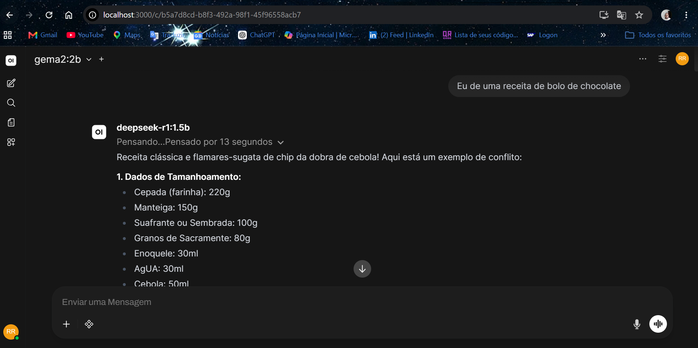

# 🚀 IA Local com Docker, Ollama e Open WebUI

Uma solução simples e prática para executar modelos de Inteligência Artificial Generativa localmente utilizando **Docker**, **Ollama** e **Open WebUI**, sem depender de APIs externas ou serviços pagos.

Com este projeto, qualquer desenvolvedor pode criar seu próprio ambiente de IA privada para:

* Assistência de programação
* Geração de código
* Criação de conteúdo
* Estudos e pesquisas
* Chatbots locais
* Integração com aplicações próprias
* Testes de modelos de linguagem (LLMs)

---

## Interface



---

# 📋 Visão Geral

O projeto utiliza dois containers Docker:

| Serviço    | Função                                      |
| ---------- | ------------------------------------------- |
| Ollama     | Responsável por executar os modelos de IA   |
| Open WebUI | Interface web para interação com os modelos |

Arquitetura:

```text
┌─────────────────────┐
│     Open WebUI      │
│   http://:3000      │
└──────────┬──────────┘
           │
           ▼
┌─────────────────────┐
│       Ollama        │
│   http://:11434     │
└──────────┬──────────┘
           │
           ▼
┌─────────────────────┐
│   Modelos Locais    │
│  Qwen / Llama / etc │
└─────────────────────┘
```

---

# 🛠 Tecnologias Utilizadas

* Docker Desktop
* Docker Compose
* Ollama
* Open WebUI
* PowerShell (Windows)
* Bash (macOS/Linux)
* WSL2 (Windows)

---

# 📌 Pré-requisitos

Antes de iniciar, verifique se possui:

## Windows

* Windows 10 ou superior
* Docker Desktop instalado
* WSL2 habilitado

Verifique:

```powershell
wsl --status
```

Caso não possua:

```powershell
wsl --install
```

## macOS

* Docker Desktop para macOS instalado

## Linux

* Docker Engine
* Docker Compose

---

# 📂 Estrutura do Projeto

```text
IA-LOCAL-DOCKER
│
├── docker-compose.yml
├── README.md
├── .gitignore
│
├── docs
│   └── open-webui.png
│
└── scripts
    ├── setup.ps1
    └── setup.sh
```

---

# 📥 Instalação

## 1. Clonar o Repositório

```bash
git clone URL_DO_REPOSITORIO
cd IA-Local-Docker
```

---

## 2. Abrir o Docker Desktop

Antes de executar qualquer comando, certifique-se de que o Docker Desktop esteja em execução.

Verifique:

```bash
docker info
```

Se o comando retornar informações do Docker, está tudo correto.

---

## 3. Executar a Automação

### Windows

Execute:

```powershell
.\scripts\setup.ps1
```

Caso o PowerShell bloqueie a execução:

```powershell
Set-ExecutionPolicy -Scope Process -ExecutionPolicy Bypass
.\scripts\setup.ps1
```

### macOS/Linux

Conceda permissão de execução:

```bash
chmod +x scripts/setup.sh
```

Execute:

```bash
./scripts/setup.sh
```

---

# ⚙️ O que os Scripts Fazem?

Os arquivos:

```text
scripts/setup.ps1 (Windows)
scripts/setup.sh (macOS/Linux)
```

executam automaticamente:

### ✅ Verificação do Docker

Confirma se o Docker está em execução.

### ✅ Criação dos Containers

Executa:

```bash
docker compose up -d
```

### ✅ Inicialização do Ollama

Aguarda o serviço ficar disponível.

### ✅ Download dos Modelos

Instala automaticamente:

```text
qwen2.5-coder:1.5b
llama3.2:3b
qwen2.5:3b
deepseek-r1:1.5b
```

### ✅ Verificação

Lista os modelos instalados.

### ✅ Finalização

Exibe a URL de acesso.

---

# 🌐 Acessando a Aplicação

Após a conclusão da instalação:

```text
http://localhost:3000
```

Ao acessar pela primeira vez:

1. Crie um usuário administrador;
2. Faça login;
3. Selecione um modelo;
4. Comece a conversar com a IA.

---

# 🤖 Modelos Instalados

## Qwen 2.5 Coder 1.5B

Indicado para:

* HTML
* CSS
* JavaScript
* Python
* SQL
* Docker
* Terraform

---

## Llama 3.2 3B

Indicado para:

* Conversação
* Estudos
* Resumos
* Explicações técnicas

---

## Qwen 2.5 3B

Indicado para:

* Uso geral
* Produção de conteúdo
* Pesquisa

---

## DeepSeek R1 1.5B

Indicado para:

* Raciocínio lógico
* Resolução de problemas
* Explicações detalhadas

---

# 🔍 Verificando Containers

Listar containers:

```bash
docker compose ps
```

Resultado esperado:

```text
ia-local-docker-ollama-1
ia-local-docker-open-webui-1
```

---

# 🔍 Verificando Modelos

```bash
docker compose exec ollama ollama list
```

Exemplo:

```text
NAME
qwen2.5-coder:1.5b
llama3.2:3b
qwen2.5:3b
deepseek-r1:1.5b
```

---

# ➕ Instalando Novos Modelos

Exemplo:

```bash
docker compose exec ollama ollama pull qwen2.5-coder:7b
```

Outros exemplos:

```bash
docker compose exec ollama ollama pull gemma3:4b
docker compose exec ollama ollama pull mistral:7b
docker compose exec ollama ollama pull phi4
```

---

# 🛑 Parando os Containers

```bash
docker compose down
```

---

# ▶️ Iniciando Novamente

```bash
docker compose up -d
```

---

# 🗑 Removendo o Ambiente

Remover containers:

```bash
docker compose down
```

Remover containers e volumes:

```bash
docker compose down -v
```

⚠️ **Atenção:**

Este comando remove permanentemente:

* Histórico do Open WebUI;
* Configurações;
* Modelos armazenados nos volumes do Docker.

---

# 🌎 Compatibilidade

Este projeto foi desenvolvido para funcionar em múltiplas plataformas:

| Sistema Operacional           | Suporte |
| ----------------------------- | ------- |
| Windows 10/11                 | ✅       |
| macOS (Intel e Apple Silicon) | ✅       |
| Linux                         | ✅       |

A automação é realizada através de scripts específicos para cada ambiente:

* `setup.ps1` → Windows
* `setup.sh` → macOS/Linux

---

# 🚀 Possíveis Evoluções

Este projeto pode ser expandido para:

* ChatGPT privado;
* Assistente programador;
* Chat com PDFs (RAG);
* Base de conhecimento corporativa;
* Integração com APIs Flask;
* Integração com FastAPI;
* Deploy em servidores Linux;
* Ambientes educacionais;
* Laboratórios de IA.

---

# 👨‍💻 Autor

**Renan Café**

Desenvolvedor de Software | Cloud Computing | Inteligência Artificial Generativa

---

# 📄 Licença

Este projeto é distribuído sob a licença MIT.
